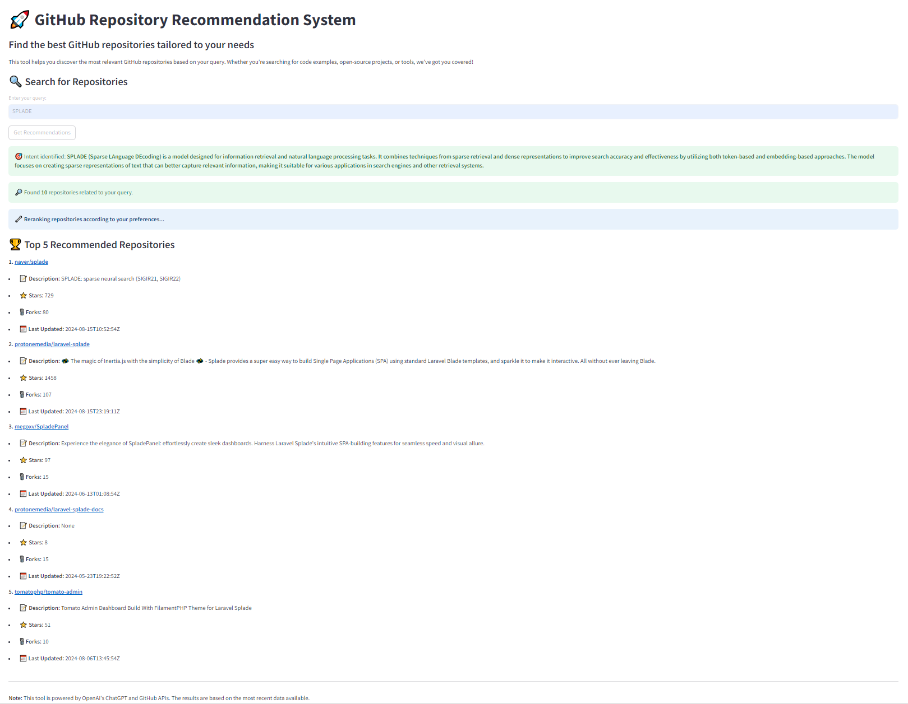

# 2024 오픈소스 개발자 대회
2024 오픈소스 개발자 대회 소스 코드입니다.
# Opensource Search Engine

## Demo


## Motivation
사용자들이 잘 알지 못하는 분야의 오픈소스를 찾기 어렵다는 점을 반영하여, Chatbot 상호작용 기반의 검색 및 추천 시스템을 개발하였습니다.

## How To Use
.env 파일을 생성한 뒤 다음 내용을 입력하세요.
```sh
OPENAI_API_KEY="Your_API_Key"
```
다음 명령어를 통해 웹 인터페이스에서 서비스를 이용할 수 있습니다:
```
streamlit run main.py
```

## Archicture
이 프로젝트는 다음과 같은 구성요소로 이루어져 있습니다:

1. **User - Chatbot Interaction**
   - 사용자가 Chatbot과 상호작용하며, 찾고자 하는 오픈소스 프로젝트를 파악하는 단계입니다.

2. **GitHub Repository Retrieve**
   - GitHub API를 통해 사용자의 입력에 따라 관련 오픈소스 프로젝트 목록을 가져오는 단계입니다.

3. **Rerank Stage**
   - 검색된 결과를 사용자의 선호도에 따라 재정렬하는 단계입니다.
   - *(향후 추가)*: 과거 사용자의 선호도를 분석하여 순위에 반영하는 기능을 추가할 예정입니다.

4. **Opensource Recommendation**
   - 재정렬된 결과를 바탕으로 사용자에게 오픈소스 프로젝트를 추천하는 단계입니다.

## Main Topic
이 프로젝트는 다음과 같은 주요 주제를 다룹니다:
1. Information Retrieval
2. Retrieve-and-Rerank
3. Langchain & Streamlit

# Training Process
모델 학습은 다음과 같은 방법으로 진행되었습니다:
- Retrieve 단계는 GPT 및 GitHub API를 사용하여 구현되었습니다.
- **Doc2Query**를 사용하여 Query와 Document(Readme) 간의 관계를 형성하여 학습에 사용하였습니다.
- **CrossEncoder** 모델을 사용하여 Reranking 단계를 수행하였습니다.